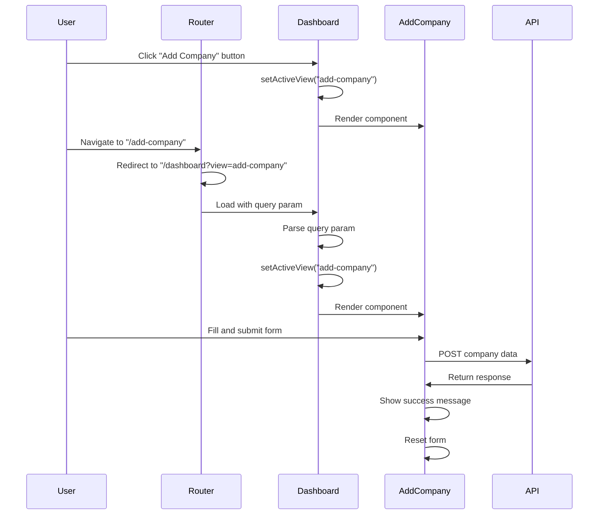

# AddCompany Integration Documentation

## Overview

This document describes the integration of the AddCompany component into the Dashboard's main content area. Previously, clicking on "Add Company" in the sidebar would navigate to a separate route. With this integration, the AddCompany form now opens within the active area where other sidebar menu items display their content, providing a more consistent user experience.

## Implementation Details

### Files Modified

1. **Dashboard.tsx**

   - Imported the AddCompany component
   - Modified the "Add Company" button to set activeView state instead of navigating
   - Added a condition to render the AddCompany component when activeView is "add-company"
   - Added support for URL query parameters to handle "/dashboard?view=add-company"

2. **App.tsx**

   - Updated the "/add-company" route to redirect to "/dashboard?view=add-company" for backward compatibility

3. **AddCompany.tsx**
   - Removed the navigation after successful form submission
   - Updated the success message to remove "Redirecting..." text

## Data Flow Diagram

The following diagram illustrates the data flow for the AddCompany component integration:

```mermaid
graph TD
    A[User] -->|Clicks Add Company| B[Dashboard Component]
    B -->|Sets activeView="add-company"| C[Render AddCompany]
    C -->|Form Submission| D[API Request]
    D -->|Response| E[Update UI]
    E -->|Success Message| C
    F[URL with ?view=add-company] -->|Parse Query Params| B
    G[/add-company Route] -->|Redirect| F
```

## Sequence Diagram

The sequence diagram below shows the interaction between components when a user accesses the AddCompany functionality:



## User Experience

With this integration:

1. Users maintain context within the Dashboard when accessing the AddCompany functionality
2. The UI is more consistent as all sidebar menu items now open in the same content area
3. The application has fewer page transitions, resulting in a smoother experience
4. Backward compatibility is maintained through URL redirection

## Technical Benefits

1. **Improved State Management**: The application maintains a single source of truth for the active view
2. **Reduced Code Duplication**: Common layout elements are not duplicated across routes
3. **Better Navigation Flow**: Users don't lose their place in the application when adding a company
4. **Simplified Routing**: The application has a more straightforward routing structure
